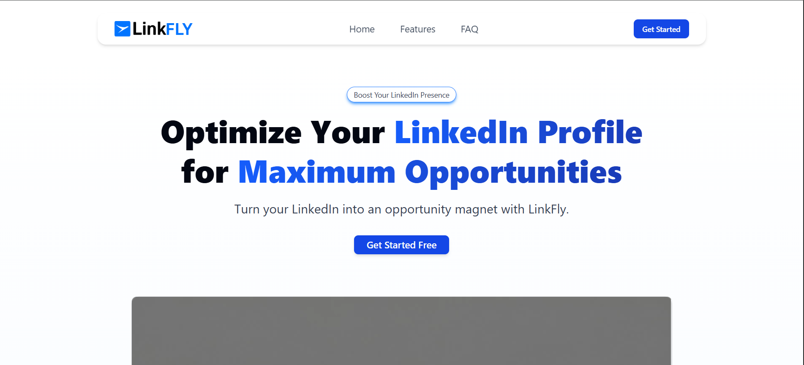

 # 🌐 LinkFly  

> AI-powered LinkedIn profile optimizer and content generator.  
Grow your professional presence, attract recruiters, and stand out with ease.  

---

## ✨ Key Features  

- 🔐 **Secure Authentication** – Seamless login powered by Better Auth with Google integration.  
- 📝 **AI-Driven Profile Optimization** – Generate compelling LinkedIn headlines and summaries tailored to your career goals.  
- 💡 **Smart Post Generator** – Create engaging, recruiter-friendly LinkedIn posts with AI assistance.  
- 📊 **Intuitive Dashboard** – A clean and minimal interface designed for productivity and quick navigation.  
- 📱 **Fully Responsive Design** – Optimized for desktops, tablets, and mobile devices.  
- ⚡ **Blazing Fast Deployment** – Hosted on Vercel for high performance and scalability.  
- 🤖 **Powered by Gemini AI** – Cutting-edge AI capabilities to enhance content quality.  
- 🗄️ **Robust Data Management** – PostgreSQL + Drizzle ORM ensuring reliability and efficiency.  


---

## 🚀 Live Demo  
👉 [LinkFly Website](https://linkfly-three.vercel.app)  

---

## 🖼️ Screenshots  

### LinkFly  
  


---

## 🛠️ Tech Stack  

- **Framework**: [Next.js 13+ (App Router)](https://nextjs.org/)  
- **Styling**: Tailwind CSS · shadcn/ui · Framer Motion  
- **Authentication**: Better Auth  
- **Database**: PostgreSQL + Drizzle ORM  
- **AI Integration**: Google Gemini  
- **Language**: TypeScript  
- **Deployment**: Vercel  

---

## ⚙️ Installation & Setup  

Clone the repo and install dependencies:  

```bash
git clone https://github.com/Bunny099/linkfly.git
cd linkfly
pnpm install
```

Create a `.env.local` file and add the required environment variables:

```bash
DATABASE_URL=" "
BETTER_AUTH_SECRET=
GOOGLE_CLIENT_ID = 
GOOGLE_CLIENT_SECRET= 
GEMINI_API_KEY = 
```

Run database migrations:
```bash
pnpm drizzle-kit generate
pnpm drizzle-kit push
```

Run the Development server:
```bash
pnpm run dev
```
The app will be available at http://localhost:3000 🎉


## 🔗 Connect with Me  

[](https://jayeshkhuman.in)
[](https://www.linkedin.com/in/jayeshkhuman)
[](https://github.com/Bunny099)


